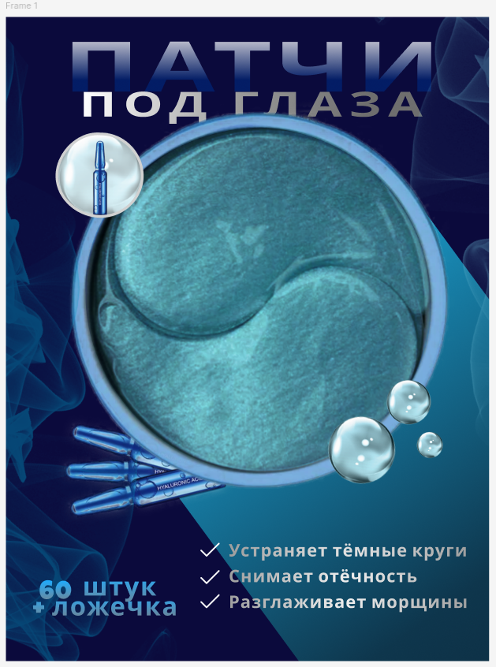

# Проект Figma - Карточка товара для Wildberries

## Описание проекта

Данный проект представляет собой дизайн карточки товара для Wildberries, рекламирующей патчи под глаза стоимостью 1000 ₽. Карточка была разработана с акцентом на качество и привлекательность для потенциальных покупателей.

### Детали проекта

- **Платформа**: Wildberries
- **Товар**: Патчи под глаза
- **Цена**: 1000 ₽
- **Цель**: Реклама и продвижение продукта

## Основные характеристики

1. **Высокое качество дизайна**: Дизайн выполнен с учетом высоких стандартов качества и оптимизирован для использования PNG файлов, чтобы продукт выглядел привлекательно и профессионально.
2. **Разработка концепции**: Визуальные элементы были тщательно продуманы для соответствия стилю бренда и привлечения целевой аудитории.
3. **Одобрение клиента**: Дизайн был согласован с заказчиком, были добавлены некоторые дополнительные идеи по улучшению.

## Инструменты и программы

- **Figma**: Использовалась для разработки и создания макета карточки товара.
- **Оптимизация PNG**: Изображения были улучшены и оптимизированы для большей четкости и яркости.

## Подход к дизайну

- **Минималистичный и чистый стиль**: Дизайн выполнен в минималистичном стиле, чтобы продукт оставался в центре внимания.
- **Соответствие бренду**: Цвета, шрифты и общий стиль согласованы с брендом заказчика для поддержания единообразия.
- **Ориентированность на пользователя**: Макет интуитивен и привлекает внимание, что улучшает пользовательский опыт.

## Обратная связь клиента и итерации

- Были представлены первоначальные концепции для ознакомления с клиентом.
- Внесены некоторые идеи по улучшению на основе обратной связи клиента.
- Финальная версия была одобрена после обсуждений и небольших корректировок.

## Как просмотреть дизайн

Вы можете просмотреть дизайн в Figma по этой [ссылке](https://www.figma.com/design/kNJv0h1011rS7uxNfBviIn/Untitled?node-id=0-1&node-type=canvas&t=aVEB7lkN0A5nzYLD-0).

## Потенциальные улучшения

- Постоянное улучшение дизайна на основе данных об использовании.
- Возможные обновления по запросу клиента или в зависимости от отзывов рынка.

## Контакты

Для вопросов или дополнительных деталей по проекту, пожалуйста, свяжитесь со мной:  
**Email**: [medizam123123@gmail.com]  
**Телефон**: [89888083109]

# Figma Design Project - Wildberries Product Card

## Project Overview

This project involves the design of a product card for Wildberries, advertising under-eye patches priced at 1000 ₽. The card has been designed with a focus on quality and presentation, aiming to catch the attention of potential customers.

### Project Details

- **Platform**: Wildberries
- **Product**: Under-eye patches
- **Price**: 1000 ₽
- **Purpose**: Advertisement and product promotion

## Key Features

1. **High-Quality Design**: The design maintains high visual quality with optimized PNG files, ensuring the product looks attractive and professional.
2. **Concept Development**: The design includes carefully crafted visual elements to match the brand's aesthetic and appeal to the target audience.
3. **Client Approval**: The design has been reviewed and approved by the client, with a few additional ideas incorporated for final touches.

## Tools and Software

- **Figma**: Used for the design and layout of the product card.
- **PNG Optimization**: Images were enhanced and optimized for clarity and sharpness.

## Design Approach

- **Minimalistic and Clean**: The design follows a minimalistic approach, making the product the focal point.
- **Brand Consistency**: Colors, fonts, and overall style were aligned with the client's branding guidelines to ensure consistency.
- **User-Centric Design**: The layout is intuitive and engaging, enhancing the user experience.

## Client Feedback and Iterations

- Initial concepts were presented to the client for review.
- A few ideas were added based on client feedback to improve the overall appeal.
- Final version was approved after discussions and minor adjustments.

## How to View the Design

You can view the design in Figma via this [link](https://www.figma.com/design/kNJv0h1011rS7uxNfBviIn/Untitled?node-id=0-1&node-type=canvas&t=aVEB7lkN0A5nzYLD-0).

## Future Improvements

- Continuous improvement of the design based on user interaction data.
- Potential updates as per client or market feedback.

## Contact

For any questions or further details regarding this project, feel free to contact me at:  
**Email**: [# Figma Design Project - Wildberries Product Card

## Project Overview

This project involves the design of a product card for Wildberries, advertising under-eye patches priced at 1000 ₽. The card has been designed with a focus on quality and presentation, aiming to catch the attention of potential customers.

### Project Details

- **Platform**: Wildberries
- **Product**: Under-eye patches
- **Price**: 1000 ₽
- **Purpose**: Advertisement and product promotion

## Key Features

1. **High-Quality Design**: The design maintains high visual quality with optimized PNG files, ensuring the product looks attractive and professional.
2. **Concept Development**: The design includes carefully crafted visual elements to match the brand's aesthetic and appeal to the target audience.
3. **Client Approval**: The design has been reviewed and approved by the client, with a few additional ideas incorporated for final touches.

## Tools and Software

- **Figma**: Used for the design and layout of the product card.
- **PNG Optimization**: Images were enhanced and optimized for clarity and sharpness.

## Design Approach

- **Minimalistic and Clean**: The design follows a minimalistic approach, making the product the focal point.
- **Brand Consistency**: Colors, fonts, and overall style were aligned with the client's branding guidelines to ensure consistency.
- **User-Centric Design**: The layout is intuitive and engaging, enhancing the user experience.

## Client Feedback and Iterations

- Initial concepts were presented to the client for review.
- A few ideas were added based on client feedback to improve the overall appeal.
- Final version was approved after discussions and minor adjustments.

## How to View the Design

You can view the design in Figma via this [link](https://www.figma.com/design/kNJv0h1011rS7uxNfBviIn/Untitled?node-id=0-1&node-type=canvas&t=aVEB7lkN0A5nzYLD-0).

## Future Improvements

- Continuous improvement of the design based on user interaction data.
- Potential updates as per client or market feedback.

## Contact

For any questions or further details regarding this project, feel free to contact me at:  
**Email**: [medizam123123@gmail.com]   
**Phone**: [89888083109]
